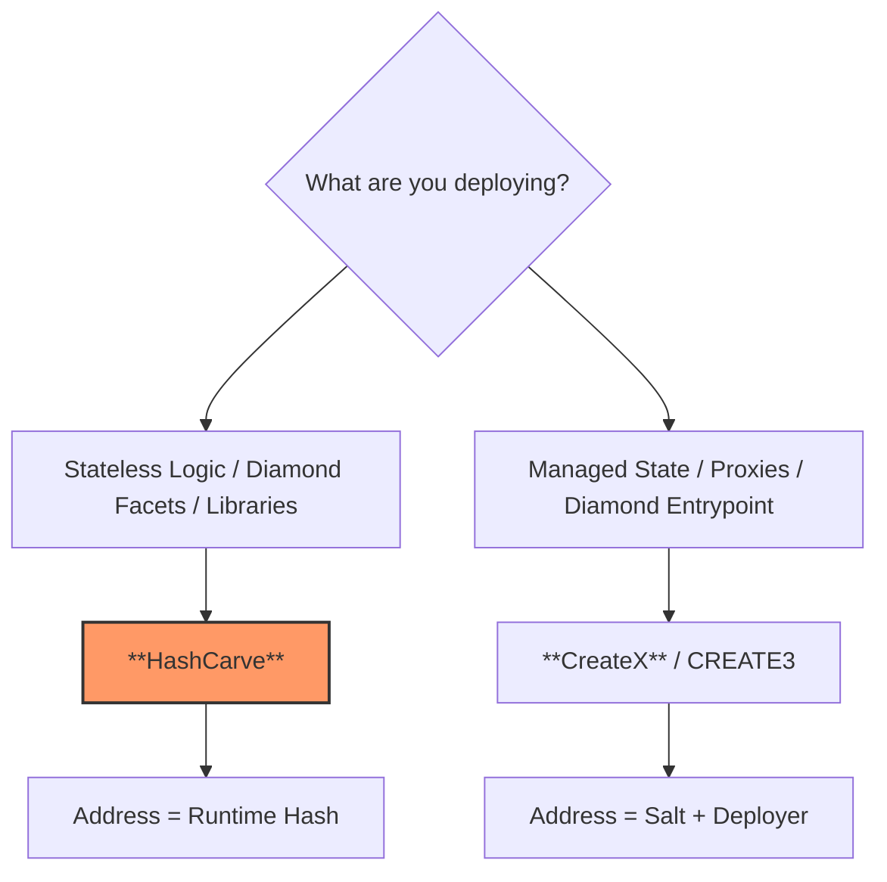

# HashCarve

**HashCarve** is a gas-optimized, multichain-consistent deployer designed for **content-addressable runtime bytecode**.

By utilizing a deterministic "micro-constructor" wrapper, HashCarve ensures that a contract's address is a direct cryptographic commitment to its runtime logic, bypassing the variability of traditional Solidity initialization.

```solidity
address deployed = HASH_CARVE.carveBytecode(runtimeBytecode);
```

## Motivation

Traditional EVM deployment via `CREATE` or `CREATE2` relies on **initcode**. This code is executed once to produce the **runtime bytecode** that eventually lives on-chain. This introduces several "black box" variables:

1. **Constructor Logic:** Different constructor arguments or internal state changes during initialization can result in different addresses for the same logic.
2. **Compiler Metadata:** Minor differences in compiler versions or optimization settings change the initcode hash, breaking cross-chain determinism.
3. **Entropy:** The need for a manually managed `salt` in `CREATE2` is not relevant for content-addressable contracts, where the identifier is the code itself.

**HashCarve** flips this. It uses the **Runtime Bytecode as the Source of Truth**. The address is derived solely from the logic itself, making code truly content-addressable across any EVM-compatible network.

This shifts the paradigm toward **maximum reusability**. By ensuring that identical logic always lives at the same address, multiple projects can reuse the same deployed bytecode. This naturally enhances security, as common facets and libraries accumulate history, trust, and public audits over time.

## TLDR When and How to Use

Use **HashCarve** in your deployment scripts:

*   **Foundry:** [Foundry deployment script](#1-with-foundry)
*   **Hardhat:** [Hardhat deployment script](#2-with-hardhat)

**Verify already deployed code:**
```solidity
bool isCanonical = HASH_CARVE.verify(deployedAddress);
```
Further details about [verification](#why-verify) (addresses are de facto bytecode hashes).

## Key Features

* **Diamond-Ready:** Optimized for [EIP-2535 Diamond Facets](https://eips.ethereum.org/EIPS/eip-2535). Since facets are stateless logic providers, they are the perfect candidate for content-addressing.
* **Gas Efficient:** Uses a minimal Yul-based micro-constructor to minimize deployment overhead.

### Compatibility

The target EVM version for **HashCarve** compilation is set to **Paris**. Neither the contract creation bytecode of HashCarve nor the returned runtime bytecode contains a `PUSH0` instruction, ensuring maximum usability and compatibility among EVM-compatible chains.

## HashCarve in the Diamond Context

In the [EIP-2535 Diamond Standard](https://eips.ethereum.org/EIPS/eip-2535), facets are often stateless logic providers. Traditionally, managing facet addresses across multiple chains can be cumbersome.

Saying **"I'm using HashCarve to deploy the facets"** carries a profound architectural implication: **facets are pointable and addressable by the hash of their bytecode.**

This property transforms how Diamonds are managed:

*   **Logical Immutability:** A facet at a HashCarve address is guaranteed to contain exactly the logic defined by its hash.
*   **Canonical Facets:** The community can converge on "canonical" facet addresses for common logic (e.g., Ownership, DiamondLoupe), as the address will be identical for everyone using HashCarve on any chain.
*   **Verification by Hash:** Users can verify the logic of a Diamond simply by checking if the facet addresses match the expected HashCarve derivation of the source code.

> **Warning ⚠️**
> **Do NOT use HashCarve for the Diamond entrypoint (the proxy contract itself).**
> HashCarve bypasses the constructor, which is typically required by the Diamond proxy to initialize essential state (like ownership and facet mappings). HashCarve is specifically designed for the **stateless facets** of the Diamond.


## How to achieve cross-chain consistency for your code

To ensure that your contract is deployed at the same address across all EVM-compatible networks, you must guarantee that the **Runtime Bytecode** generated by the compiler is identical.

### 1. Fix the Compiler Version
Different compiler versions produce different bytecode for the same source code due to optimizer improvements or internal changes.

*   **Solidity:** Pin an exact version (e.g., `solc_version = "0.8.33"`) in your configuration and ensure it is used for all chain deployments.
*   **Vyper:** Use an exact version (e.g., `0.3.10`) and avoid "latest" tags.

### 2. Stable Optimizer & EVM Version
For Solidity, it is recommended to enable `via_ir = true` to ensure more consistent and optimized bytecode generation across different environments.
Optimizer runs and the target EVM version (e.g., `shanghai`, `paris`) must be identical. 
> **Note:** Setting the EVM version to **Paris** is highly recommended for maximum compatibility, as it avoids the `PUSH0`  and `CLZ` and other newer opcodes, which are not supported on all EVM networks.

```toml
# Example foundry.toml for Solidity
[profile.default]
solc_version = "0.8.33"
via_ir = true
evm_version = "paris"
optimizer = true
optimizer_runs = 10_000_000
```

### 3. Stripping Metadata (Logic-only Identity) (optional)
Solidity and Vyper by default append a CBOR metadata hash to the bytecode. This hash includes the IPFS hash of the source code and compiler settings. **Changing even a single comment in the source code will change the metadata, resulting in a different address.**

To ensure the address depends only on the functional logic, use the following `foundry.toml` settings:

```toml
bytecode_hash = "none"
cbor_metadata = false
```

*Note: This results in **partial verification** on block explorers, as the metadata hash is no longer present in the bytecode.*

## Contract Verification: The `verify()` Function

One of the most powerful features of HashCarve is its ability to verify the integrity and origin of any deployed contract on-chain.

### Why verify?

In a multichain environment, you often need to ensure that a contract at `address X` actually contains the logic you expect. Traditional verification involves checking block explorers (Etherscan), which relies on off-chain data and trust in the explorer's verification engine.

The `verify(address target)` function provides **on-chain, cryptographic proof**:
1.  **Origin Proof**: It confirms the contract was deployed by **this** specific HashCarve instance.
2.  **Logic Integrity**: It guarantees that the contract's address is exactly the CREATE2 result of its own runtime bytecode wrapped in the canonical HashCarve micro-constructor.

If `verify(target)` returns `true`, you have absolute certainty that the logic at that address is "canonical" and hasn't been tampered with or deployed via a non-compliant factory.

### How it works

The `verify` function performs the following steps in a single, gas-efficient static call:
1.  Loads the **runtime bytecode** from the `target` address.
2.  Prepends the HashCarve **micro-constructor**.
3.  Calculates the **CREATE2 address** that would result from that payload using the fixed salt (`0`).
4.  Compares the calculated address with the `target` address.

> This allows for seamless, trustless integration where your proxy or registry can automatically verify facets before allowing them to be added. It also means that the design blueprint of your solution can contain these deployment addresses as de facto bytecode hashes, so no extra runtime bytecode hash is needed for verification.

## Decision Tree: Choosing Your Deployment Strategy

Not every contract belongs in HashCarve. Choosing the right tool ensures long-term maintainability and cross-chain consistency.



### 1. Use HashCarve for Stateless Logic
**Target:** Diamond Facets, Libraries, Logic Implementations.

**Philosophy:** Identity = Logic. **Permissionless.**

**Why:** Since these contracts are stateless, their address should be a cryptographic commitment to their behavior. HashCarve allows for **permissionless** deployment where anyone can recreate the same logical identity on any chain. This prevents "logic-identity" mismatches and ensures that the codebase itself defines its location on the network.

### 2. Use CreateX.CREATE3 for Managed Infrastructure
**Target:** Diamond Entrypoints (Proxies), Token entrypoints, Governance entrypoints.

**Philosophy:** Identity = Role/Location. **Non-Permissionless.**

**Why:** These contracts often require initialization (via constructors or initializers) to set up state (owners, linked contracts). Since this setup is specific to the system owner and might vary across chains, the deployment is **not permissionless**. The address depends on the deployer and a salt, ensuring the infrastructure identity is controlled and managed by a specific entity.

### Why HashCarve? Why not CREATE2 factory? (The "Contractual Commitment" Difference)

While standard `CREATE2` allows for deterministic deployment, it only provides a commitment to the **initcode** (the deployment instructions). It does **not** provide a contractual commitment to the resulting **runtime bytecode**. An malicious or complex initcode could execute logic that results in different runtime states while sharing the same address.

**HashCarve** shifts the commitment to the **Result**:
*   **Commitment to Logic:** The address is a direct cryptographic commitment to the **final runtime bytecode**. It is impossible to deploy different code at a HashCarve-derived address.
*   **Permissionless Canonicality:** By removing the arbitrary 32-byte `salt`, HashCarve creates a universal mapping between logic and location. Anyone can discover the "canonical" address for a piece of code without needing to coordinate on a secret or external salt.
*   **Metadata Transparency:** While source code changes (comments/names) still change the metadata and thus the address, HashCarve makes this explicit. You are hashing exactly what is delivered on-chain, not a complex set of "instructions to deliver" (initcode) that might include or obfuscate metadata differently.

### Comparative Overview

| Feature | HashCarve | CreateX.CREATE3 |
| :--- | :--- | :--- |
| **Primary Driver** | Runtime Bytecode | User-defined Salt + Deployer |
| **Address Identity** | **Content-Addressable**: Address is a commitment to the logic. | **Salt-Addressable**: Address is a commitment to the Salt + Deployer address. |
| **Address Stability** | Changes if a single Opcode changes. | Remains the same even if Bytecode/Metadata changes. |
| **Constructor Support** | **None**: Bypasses constructors for pure runtime deployment. | **Full**: Executes constructors and handles init arguments. |
| **Ideal For** | Stateless Facets, Libraries, Immutable Primitives. | Proxy Entrypoints, Managed Contracts |
| **Security Model** | Immune to Address Hijacking (Address = Hash). | Requires owner-controlled salts to prevent front-running. |


## Technical Specification

### The Formula

The deployment address is calculated using the CREATE2 opcode:

```
Address = keccak256(
    0xff ++ 
    HashCarveAddress ++ 
    0x0000000000000000000000000000000000000000000000000000000000000000 ++ 
    keccak256(MICRO_CONSTRUCTOR ++ RuntimeBytecode)
)[12:]
```
Where the **MicroConstructor** is a constant 11-byte sequence that returns the appended runtime bytecode.

### Related Discussions

* **EIP Discussion:** [Deterministic Pure Runtime Bytecode Deployment](https://ethereum-magicians.org/t/eip-potential-proposal-deterministic-pure-runtime-bytecode-deployment/23070)
* **EIP-2535:** [Diamond Standard](https://eips.ethereum.org/EIPS/eip-2535)

---

## Security Warnings ⚠️

### 1. No Initialization

**HashCarve** bypasses the Solidity constructor. This means:

* **Immutable variables** cannot be set at deployment time.
* The `constructor` block in your Solidity source will **not** be executed.
* Internal state variables cannot be initialized during deployment.
**Solution:** Use the `initializer` pattern (e.g., OpenZeppelin Initializable) if the contract requires state setup, though this is discouraged for pure Diamond facets.

### 2. Static Analysis Bypass

Because the code is deployed as raw bytecode, some basic block explorers or security scanners might fail to automatically link the source code unless the runtime bytecode matches the compiled output of the source exactly (metadata stripped).

### 3. Non-Standard Deployment

Ensure the runtime bytecode provided is valid and includes a proper `STOP` or `REVERT` sequence. Deploying "junk" data is possible but will result in a broken contract address that cannot be interacted with.

---

## Usage

### 1. With Foundry

Foundry users can interact with HashCarve directly using Solidity scripts or tests.

```solidity
import {console} from "forge-std/console.sol";

interface IHashCarve {
    error DeploymentFailed();
    function carveBytecode(bytes calldata runtimeBytecode) external returns (address addr);
    function addressOfBytecode(bytes calldata runtimeBytecode) external view returns (address addr);
}

contract DeployScript {
    // HashCarve canonical address
    IHashCarve constant HASH_CARVE = IHashCarve(0xD8c29839A0CD757dc1Add3F9A44546195d7abeBa);

    function run() external {
        // Check if HashCarve is deployed on this chain (checking bytecode integrity)
        // Note: Hash depends on compiler version 0.8.33 and specific settings
        bytes32 expectedHash = 0x4282d9fbb34f00095c1c3333eb320e7882ba1cde3c68917a1794fa7f6b6aa359;
        if (address(HASH_CARVE).codehash != expectedHash) {
            revert("HashCarve not found at expected address or bytecode mismatch. Please deploy it first.");
        }

        // Use .runtimeCode for the code that should live on-chain
        bytes memory runtimeBytecode = type(MyContract).runtimeCode;

        // Predict address
        address predicted = HASH_CARVE.addressOfBytecode(runtimeBytecode);

        // Deploy if not already present
        if (predicted.code.length == 0) {
            address deployed = HASH_CARVE.carveBytecode(runtimeBytecode);
            console.log(
                string.concat("Deployed to: ", vm.toString(deployed), " hash: ", vm.toString(deployed.codehash))
            );
        } else {
            console.log(
                string.concat(
                    "Already deployed at: ", vm.toString(predicted), " hash: ", vm.toString(predicted.codehash)
                )
            );
        }
    }
}
```

### 2. With Hardhat

In Hardhat, you can use `ethers.js` to interact with the factory. Ensure you are using the **runtime** bytecode (also known as `deployedBytecode` in Hardhat/Truffle artifacts).

```javascript
const { ethers } = require("hardhat");

async function main() {
  const hashCarveAddress = "0xD8c29839A0CD757dc1Add3F9A44546195d7abeBa"; // HashCarve canonical address
  const hashCarve = await ethers.getContractAt("IHashCarve", hashCarveAddress);

  // Check if HashCarve is deployed on this chain (checking bytecode integrity)
  const expectedHash = "0x4282d9fbb34f00095c1c3333eb320e7882ba1cde3c68917a1794fa7f6b6aa359";
  const factoryCode = await ethers.provider.getCode(hashCarveAddress);
  if (ethers.keccak256(factoryCode) !== expectedHash) {
    throw new Error("HashCarve not found at expected address or bytecode mismatch.");
  }

  // Read the artifact of the contract you want to deploy
  const artifact = await artifacts.readArtifact("MyContract");
  const runtimeBytecode = artifact.deployedBytecode;

  // Predict
  const predicted = await hashCarve.addressOfBytecode(runtimeBytecode);

  // Check if deployed
  const code = await ethers.provider.getCode(predicted);
  if (code === "0x") {
    const tx = await hashCarve.carveBytecode(runtimeBytecode);
    await tx.wait();
    const finalCode = await ethers.provider.getCode(predicted);
    console.log(`Deployed to: ${predicted} hash: ${ethers.keccak256(finalCode)}`);
  } else {
    console.log(`Already deployed at: ${predicted} hash: ${ethers.keccak256(code)}`);
  }
}
```

## HashCarve Deployments

### EVM-Based Production Networks

### EVM-Based Test Networks


## License

[MIT](https://www.google.com/search?q=LICENSE)

---

Created with love by **BeerFi Prague** web3 builders community 🍻
